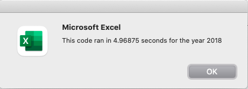
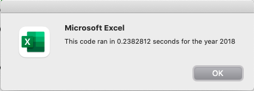
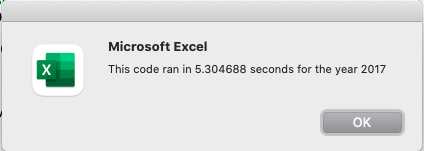

# Stock Analysis

## Background
The initial purpose of our analysis is to help Steve's parents analyse:
* how actively DQ was traded in 2018 as they believe that if a stock is traded often, then the price will accurately reflect the value of the stock. We sum up all of the daily volume for DQ to get the yearly volume and a rough idea of how often it gets traded. We calculate the yearly return for DQ. The yearly return is the percentage increase or decrease in price from the beginning of the year to the end of the year. In other words, if you invested in DQ at the beginning of the year and never sold, the yearly return is how much your investment grew or shrunk by the end of the year.
From this, we found out that Daqo dropped over 63% in 2018.
* Due to the above, we replicated our script to analyse all the stocks on the dataset to give Steve's parents a full view of all the stocks' performance.
* In order to make the spreadsheet more user-friendly, we've included buttons to make it easier for Steve to use.
* We've also added flexiblity for Steve to input the year he is interested to analyse with an input field.
* We've also added a functionality to calculate how long it takes to execute the output and elapsed time in a message box.

From this work, Steve is able to use the tool with ease and churn his dataset for analysis.

## Overview of Project

Steve loves the workbook prepared for him. At the click of a button, he can analyze an entire dataset. Now, to do a little more research for his parents, he wants to expand the dataset to include the entire stock market over the last few years. Although the code works well for a dozen stocks, it might not work as well for thousands of stocks. And if it does, it may take a long time to execute.

The same dataset from his first stock analysis will be used to measure the runtime difference.

### Purpose
The current dataset in the spreadsheet is small and already it takes a few seconds to run each year. Therefore, in order to expand to include many years and more stocks, we need to reduce the runtime through code refactoring.

## Analysis OR Challenges

## Methodology: Analytics Paradigm

#### 1. Decomposing the Ask
To get the codes working faster and more elegantly with less traversal of the dataset.

#### 2. Identify the Datasource
Same dataset is used.

#### 3. Define Strategy & Metrics
Look at the current code and visualise the calls and routines to refine and reduce data calls.
Store data into arrays.

#### 4. Data Retrieval Plan
Use stock analysis dataset in Excel

#### 5. Assemble & Clean the Data
Excel VBA scripting

#### 6. Analyse for Trends
Compare timer from old codes with new codes

#### 7. Acknowledging Limitations
* Unable test out the new codes with a much larger dataset for a dry-run.
* Using VBA, the scripts will run in real-time.

#### 8. Making the Call:
The "Proper" Conclusion is indicated below on [Results](#results)

## Analysis

**2018 timer**

>Old Runtime for 2018



>New Runtime for 2018



With the new code, our runtime is 0.238 seconds compared to 4.96 seconds.

**2017 timer**

>Old Runtime for 2017



>New Runtime for 2017


With the new code, our runtime is 0.261 seconds compared to 5.3 seconds.

We can conclude above that the speed increase for the data are:

**2018:** 20.8 times faster

**2017:** 20.3 times faster

We've decided to include other efficiencies in the code by:-

* **Storing results in an array & reducing iterations**

In the old code, we have nested for loops

```
For i
  For j
    ...
  Next j
Next i  

```
The above means that we are running 3011*3011 loops.

In the new code, we have an array to store our results for all the 12 different tickers.

```
  Dim tickerVolumes(11) As Long
  Dim tickerStartingPrices(11) As Single
  Dim tickerEndingPrices(11) As Single
```

And our code is

```
For j
  ...
Next j

For i
  ...
Next i  

```

Which means it is only runs 2*3011 loops.

* **Changing the initial code base from**

```
    'Initialize array of all tickers
    Dim tickers(12) As String
```

to
```
    'Initialize array of all tickers
    Dim tickers(11) As String
```

By doing this, we decrease the size of the tickers() array to only what we need and it shows that both 2018 and 2017, runtime is around 0.223 which reduces by 0.03 seconds.

The read the full code, see [Appendix](#appendix).

## Results
From [Analysis](#analysis) we can conclude that the speed increase for the data are:

**2018:** 20.8 times faster

**2017:** 20.3 times faster

With 3011 dataset each, our runtime is approximately 0.2 seconds. Therefore when we analyse tens of thousands of dataset, the results will be available within a few minutes compared to a few hours with the old codes.

## Summary

### Refactoring Code

**Advantages**

* Saves time by reducing error as no new functionality is added, only code cleanup for efficiency
* Reduce code complexity and increase code readability.
* Ensures that it's scalable and can be easily maintained for the future.

**Disadvantages**

* Only can be done if the developer is proficient in the programming language
* The developer who doesn't know will not have new methods for efficiency and might even end up breaking the original codes.
* The developer need to spend more time debugging or studying to be able to come up with a better code structure.

**How do these pros and cons apply to refactoring the original VBA script?**


## Appendix
```
Sub AllStocksAnalysisRefactored()
    Dim startTime As Single
    Dim endTime  As Single

    yearValue = InputBox("What year would you like to run the analysis on?")
    startTime = Timer

    'Format the output sheet on New All Stocks Analysis worksheet
    Worksheets("All Stocks Analysis").Activate
    Range("A1").Value = "All Stocks (" + yearValue + ")"

    'Create a header row
    Cells(3, 1).Value = "Ticker"
    Cells(3, 2).Value = "Total Daily Volume"
    Cells(3, 3).Value = "Return"

    'Initialize array of all tickers
    Dim tickers(11) As String

    tickers(0) = "AY"
    tickers(1) = "CSIQ"
    tickers(2) = "DQ"
    tickers(3) = "ENPH"
    tickers(4) = "FSLR"
    tickers(5) = "HASI"
    tickers(6) = "JKS"
    tickers(7) = "RUN"
    tickers(8) = "SEDG"
    tickers(9) = "SPWR"
    tickers(10) = "TERP"
    tickers(11) = "VSLR"

    'Activate data worksheet
    Worksheets(yearValue).Activate

    ' Get the number of rows to loop over
    RowCount = Cells(Rows.Count, "A").End(xlUp).Row

    '1a) Create a ticker Index
    Dim tickerIndex As Integer
    tickerIndex = 0

    '1b) Create three output arrays
    Dim tickerVolumes(11) As Long
    Dim tickerStartingPrices(11) As Single
    Dim tickerEndingPrices(11) As Single

    '2a) Create a for loop to initialize the tickerVolumes to zero.
        For i = 0 To 11
        tickerVolumes(i) = 0
        Next i

    '2b) Loop over all the rows in the spreadsheet.
        For j = 2 To RowCount

        '3a) Increase volume for current ticker
        tickerVolumes(tickerIndex) = tickerVolumes(tickerIndex) + Cells(i, 8).Value

        '3b) Check if the current row is the first row with the selected tickerIndex.
        If Cells(j - 1, 1).Value <> tickers(tickerIndex) And Cells(j, 1).Value = tickers(tickerIndex) Then
            tickerStartingPrices(tickerIndex) = Cells(j, 6).Value
        End If

        '3c) check if the current row is the last row with the selected ticker
         'If the next row’s ticker doesn’t match, increase the tickerIndex.
        If Cells(j + 1, 1).Value <> tickers(tickerIndex) And Cells(j, 1).Value = tickers(tickerIndex) Then
                tickerEndingPrices(tickerIndex) = Cells(j, 6).Value

            '3d Increase the tickerIndex.
            tickerIndex = tickerIndex + 1

            End If

    Next j

    '4) Loop through your arrays to output the Ticker, Total Daily Volume, and Return.
    For i = 0 To 11
        Worksheets("All Stocks Analysis").Activate
        Cells(4 + i, 1).Value = tickers(i)
        Cells(4 + i, 2).Value = tickerVolumes(i)
        Cells(4 + i, 3).Value = tickerEndingPrices(i) / tickerStartingPrices(i) - 1
    Next i

    'Formatting
    Worksheets("All Stocks Analysis").Activate
    Range("A3:C3").Font.FontStyle = "Bold"
    Range("A3:C3").Borders(xlEdgeBottom).LineStyle = xlContinuous
    Range("B4:B15").NumberFormat = "#,##0"
    Range("C4:C15").NumberFormat = "0.0%"
    Columns("B").AutoFit

    dataRowStart = 4
    dataRowEnd = 15

    For i = dataRowStart To dataRowEnd
        If Cells(i, 3) > 0 Then
            Cells(i, 3).Interior.Color = vbGreen
        Else
            Cells(i, 3).Interior.Color = vbRed
        End If
    Next i

    endTime = Timer
    MsgBox "This code ran in " & (endTime - startTime) & " seconds for the year " & (yearValue)

End Sub


```
